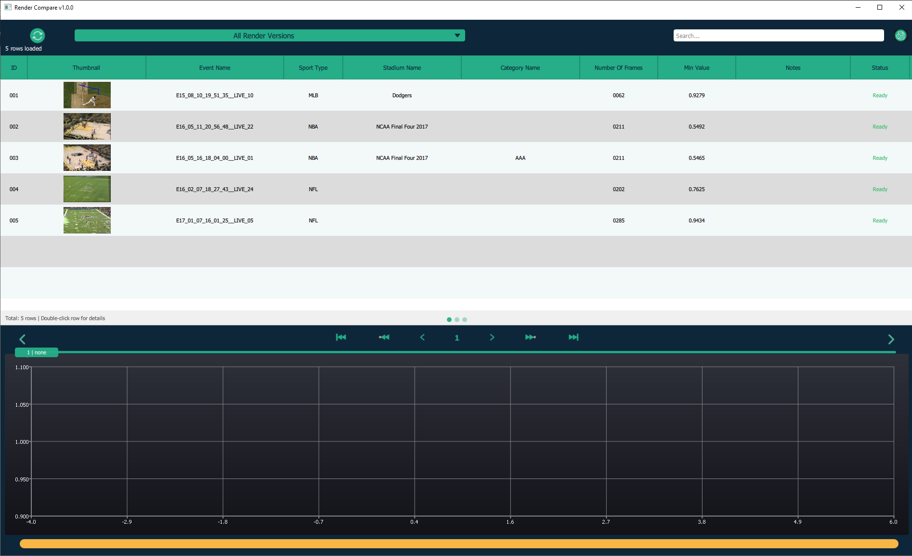
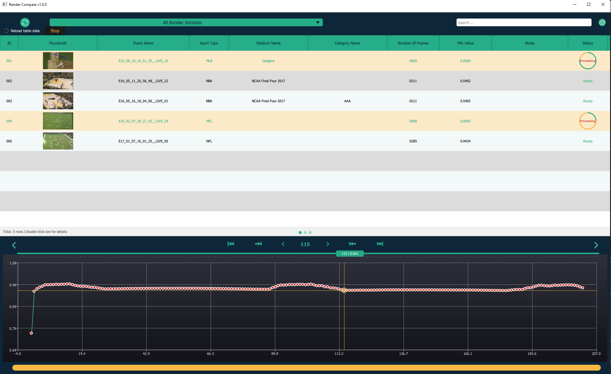
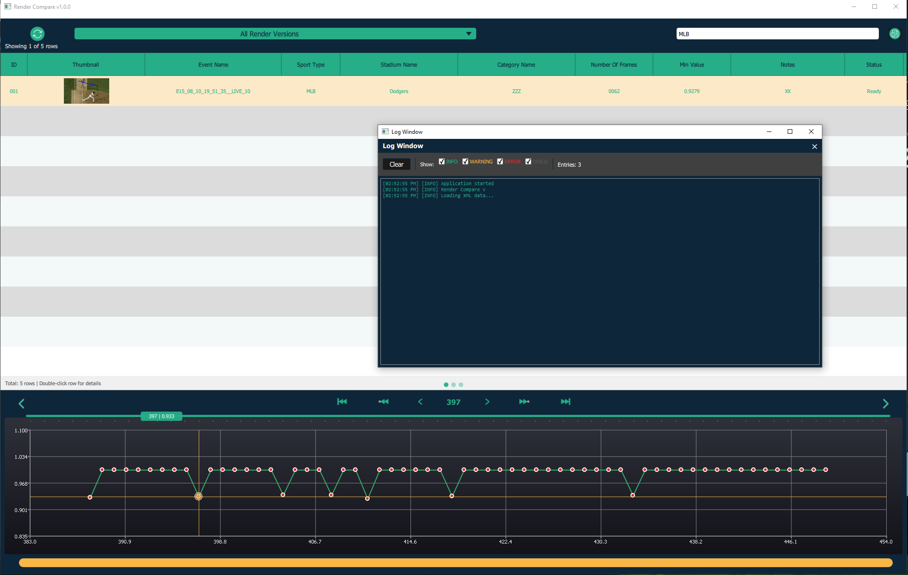
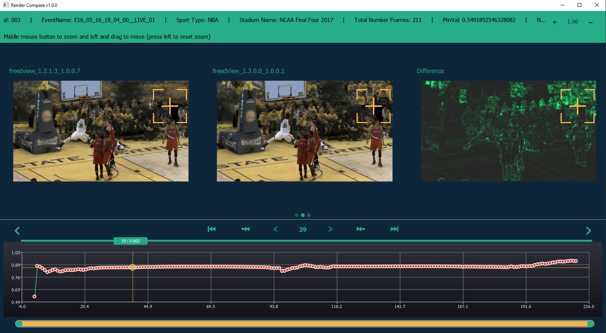
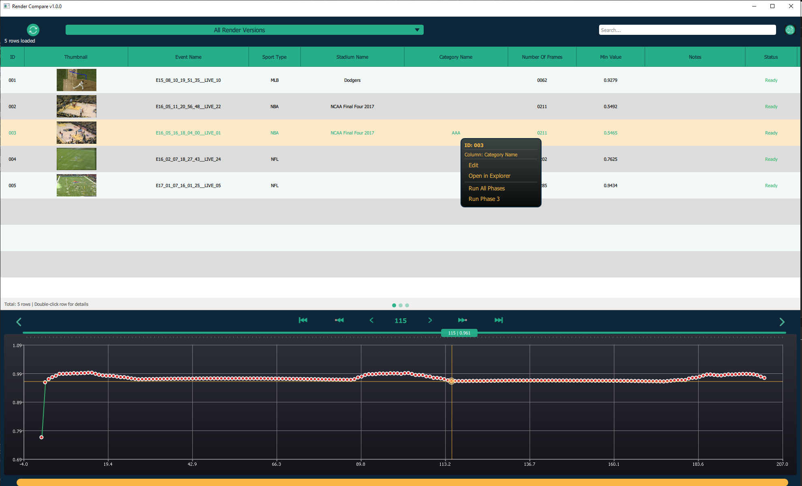
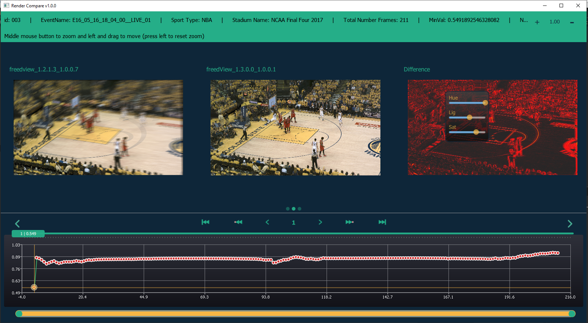
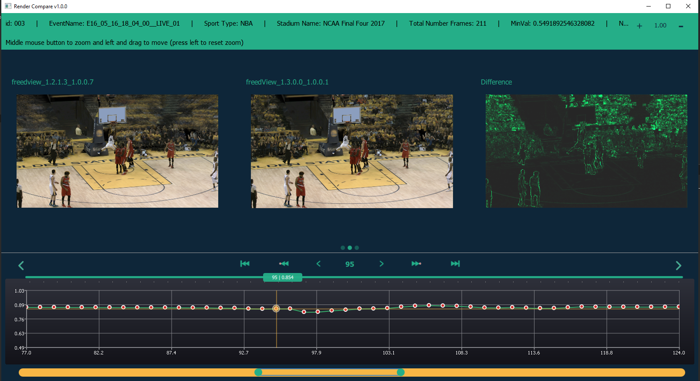
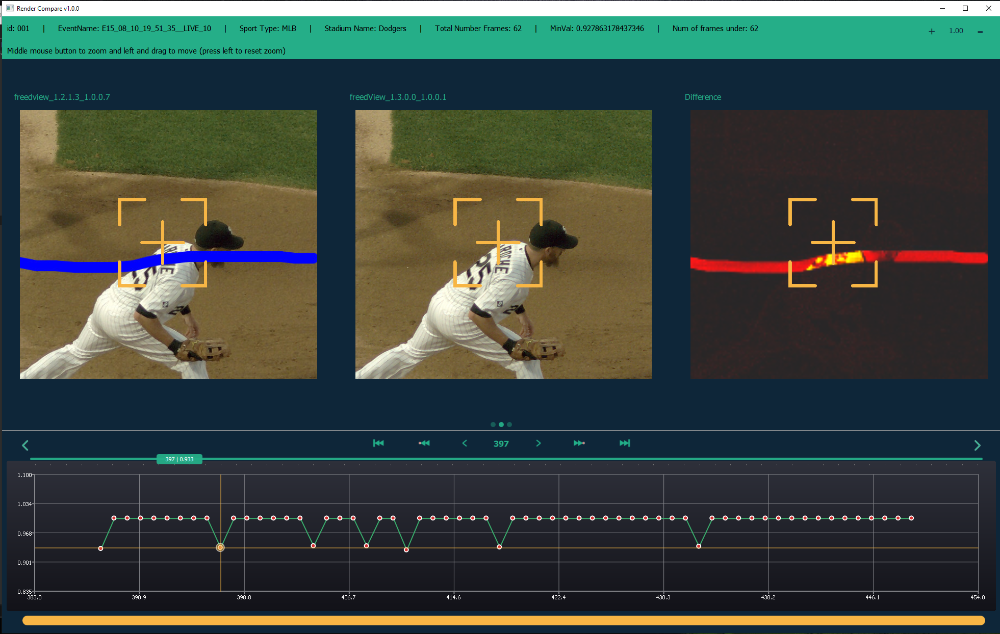
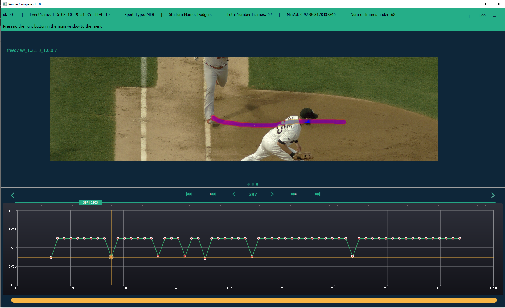

# Render Compare

Professional Qt/QML desktop application for visualizing and analyzing rendered image sequence comparisons. This tool provides an interactive interface for comparing FreeDView renderer outputs, identifying visual differences, and managing batch rendering operations.

## TL;DR

-   **Interactive Visualization**: Three-page interface for event selection, side-by-side comparison, and detailed analysis
-   **Frame-by-Frame Analysis**: Smooth scrubbing through image sequences with synchronized timeline chart
-   **Multi-Window Comparison**: Side-by-side view of original, test, and difference images with synchronized zoom/pan
-   **Alpha Channel Analysis**: Single-window view with A/B toggle for detailed mask inspection
-   **Version Management**: Filter and compare different FreeDView render versions
-   **Performance Optimized**: Double-buffered image loading, LRU cache, background XML parsing
-   **Thread-Safe Architecture**: Proper mutex usage, queued connections, background workers
-   **Batch Rendering Integration**: Executes external `freeDView_tester` Python script for automated rendering
-   **Real-Time Progress Tracking**: Progress bars and status updates for long-running operations
-   **Professional Error Handling**: Comprehensive error dialogs and user feedback
-   **Search and Filter**: Table view with search functionality and version-based filtering

**Quick Start:**
```bash
qmake renderCompare.pro
make
./renderCompare
```

## Image Gallery

<table>
<tr>
<td></td>
<td></td>
<td></td>
</tr>
<tr>
<td></td>
<td></td>
<td></td>
</tr>
<tr>
<td></td>
<td></td>
<td></td>
</tr>
</table>

------------------------------------------------------------------------

## Overview

Render Compare is a Qt/QML desktop application designed to visualize and analyze the comparison results generated by the `freeDView_tester` tool. It provides an interactive interface for browsing diff images, alpha masks, and XML reports, enabling visual inspection of render differences between FreeDView versions.

The application was originally developed to support the needs of my team at Intel, providing a user-friendly interface for analyzing automated render comparison results and identifying visual regressions.

The system follows a clean architecture with clear separation of concerns:
- **C++ Backend**: Data management, XML parsing, image path resolution, external process execution
- **QML Frontend**: UI components, user interactions, visual presentation
- **File-Based Communication**: Integrates with `freeDView_tester` output via XML files

This architecture allows the UI to remain responsive during heavy operations (XML parsing, image loading) while providing a smooth, interactive user experience.

------------------------------------------------------------------------

# Application Structure

## Three-Page Interface

The application uses a swipe-based navigation system with three main views:

### Page 0: Table View (Event Selection)

The main interface for selecting and managing event sets.

**Features:**
- Sortable and filterable table displaying all test events
- Search functionality (Ctrl+F) for quick filtering
- FreeDView version dropdown for filtering by render version
- Progress bars for ongoing render comparison operations
- Status indicators (Ready, Rendered not compare, Not Ready)
- Double-click to open event set for comparison
- Context menu for editing notes, opening in Explorer, running tests

**Data Displayed:**
- Event ID, Name, Sport Type, Stadium Name, Category Name
- Number of frames, Minimum value (SSIM), Notes
- Thumbnail preview, Status

### Page 1: Three-Window Comparison View

Side-by-side comparison of original, test, and difference images.

**Features:**
- **Window A**: Original/expected render (imageA)
- **Window B**: Test/actual render (imageB)
- **Window C**: Difference visualization (imageC) with HOT colormap
- Synchronized zoom and pan across all three windows
- Synchronized image marks (crosshairs) for precise comparison
- FreeDView version labels showing which versions are being compared
- Individual image effect controls (hue, saturation, lightness) for each window
- Interactive timeline chart with frame navigation
- Frame threshold visualization (red scatter points for frames below threshold)

**Use Case**: Best for identifying where differences occur and comparing overall visual quality.

### Page 2: Single Large Window View

Detailed inspection view with alpha mask overlay and A/B toggle.

**Features:**
- Large single-window view for detailed inspection
- Alpha mask (imageD) overlay with adjustable opacity
- Toggle between original (imageA) and test (imageB) renders (click text or middle mouse button)
- FreeDView version labels
- Full zoom and pan capabilities
- Image effect controls (hue, saturation, lightness, opacity)
- Interactive timeline chart (shared with Page 1)
- Smooth frame scrubbing with double-buffered image loading

**Use Case**: Best for detailed analysis of specific frames and alpha channel inspection.

------------------------------------------------------------------------

## Architecture

The system follows a modular architecture with clear separation between C++ backend and QML frontend:

### C++ Backend Components

#### 1. XmlDataModel (`src/xmldatamodel.h/cpp`)
**Purpose**: Provides data model for table view, loads XML files in background

**Key Features:**
- Extends `QStandardItemModel` for QML TableView integration
- Background loading via `XmlDataLoader` and `QThread`
- Caching of parsed XML data to avoid re-parsing
- Role-based data access for QML bindings
- Thread-safe data updates via queued connections

**Threading Model:**
- XML parsing runs in background thread (`XmlDataLoader`)
- Main thread receives data via signals when parsing completes
- Mutex protection for shared data structures

#### 2. ImageLoaderManager (`src/imageloadermanager.h/cpp`)
**Purpose**: Manages image paths and implements LRU cache for QPixmap objects

**Key Features:**
- Provides file paths to QML (QML handles native image loading)
- LRU cache for QPixmap objects (configurable size)
- Thread pool for background image operations
- Path resolution based on image type (A, B, C, D)
- Relative path resolution from XML files

**Design Decision**: Provides paths rather than QML ImageProvider for better performance and flexibility.

#### 3. IniReader (`src/inireader.h/cpp`)
**Purpose**: Reads configuration from `renderCompare.ini` file

**Key Features:**
- Automatic INI file discovery (multiple fallback paths)
- Exposes configuration via Q_PROPERTY for QML access
- Path resolution for relative paths
- Error handling for missing or invalid INI files

#### 4. TesterRunner (`src/freeDView_tester_runner.h/cpp`)
**Purpose**: Executes external `freeDView_tester` Python script via QProcess

**Key Features:**
- Progress tracking via stdout parsing
- Per-test progress updates (keyed by testKey)
- Error handling and signal propagation
- Supports multiple test phases (all, compare, prepare-ui)
- Process management (start, stop, kill)

#### 5. SortFilterProxyModel (`src/sortfilterproxymodel.h/cpp`)
**Purpose**: Provides sorting and filtering for table view

**Key Features:**
- Extends `QSortFilterProxyModel`
- Custom filtering logic for render versions
- Search functionality across all columns
- Dynamic filter updates

### QML Frontend Components

#### Core Application Structure

```
Main.qml (Root)
├── SplitView
│   ├── TableView (Page 0: Event Selection)
│   │   ├── MainTableViewHeader.qml (Search, filter, controls)
│   │   ├── TableviewHandlers.qml (State management, signals)
│   │   ├── TableviewTable.qml (Table display, context menu)
│   │   └── TableviewDialogs.qml (Edit, error dialogs)
│   └── TheSwipeView.qml (Navigation Container)
│       ├── TopLayout_zero.qml (Page 0: Table View)
│       ├── TopLayout_three.qml (Page 1: 3-Window Comparison)
│       │   ├── ImageItem.qml (×3: A, B, C)
│       │   └── InfoHeader.qml (Event metadata, frame stats)
│       └── TopLayout_one.qml (Page 2: Single Window)
│           ├── ImageItem.qml (D with A/B toggle)
│           └── InfoHeader.qml (Event metadata, frame stats)
└── TimelineChart.qml (Shared across pages 1 & 2)
```

#### Key QML Components

**ImageItem.qml**: Reusable image display component with zoom, pan, and effects
- Zoom and pan with mouse/touch gestures
- Image mark synchronization across views
- Context menu for image effects (hue, saturation, lightness, opacity)
- Smooth animations

**TimelineChart.qml**: Interactive timeline chart for frame visualization
- Scatter plot with frame values
- Interactive timeline slider
- Zoom and pan functionality
- Threshold-based filtering
- Navigation to problematic frames

**ReloadedAllImages.qml**: Image management with double-buffered loading
- Dynamic loading of image components (ImageFileAB, ImageFileC, ImageFileD)
- Double-buffered image loading for smooth frame scrubbing
- Integration with ImageLoaderManager
- Pass-through for image effect controls

### Data Flow

#### Loading Event Data

```
User double-clicks row
    ↓
TopLayout_zero.qml::openSelectedSet()
    ↓
Main.qml::openProjectUpdate()
    ↓
TheSwipeView::initializeImageViews()
    ↓
ImageItem::startLoadAllImages()
    ↓
ReloadedAllImages::startLoadAllImages()
    ↓
ImageLoaderManager::getImageFilePath() (for each frame)
    ↓
QML Image component loads from file path
```

#### Frame Scrubbing

```
User moves timeline slider
    ↓
TimelineChart::moveMarks()
    ↓
Main.qml::changeIndex()
    ↓
TheSwipeView::indexUpdate()
    ↓
TopLayout_three/one::indexUpdate()
    ↓
ImageItem::indexUpdate()
    ↓
ReloadedAllImages::indexUpdate()
    ↓
ImageFileAB/C/D::indexUpdate() (double-buffered loading)
```

#### Version Switching (Page 2)

```
User presses middle mouse button
    ↓
ImageItem::onClicked() (Qt.MiddleButton)
    ↓
ReloadedAllImages::imageSwitchOnTypeD()
    ↓
ImageFileD::imageSwitc()
    ↓
Toggle opacity between buffer1ImageHoldA and buffer1ImageHoldB
    ↓
Load newly visible version if not already loaded (lazy loading)
```

------------------------------------------------------------------------

# Architecture Diagram

```
┌─────────────────────────────────────────────────────────────┐
│                    Main.qml (Root)                          │
│  ┌──────────────────────┐  ┌──────────────────────────────┐ │
│  │   TableView          │  │   TheSwipeView               │ │
│  │   (Page 0)           │  │   (Navigation)               │ │
│  │                      │  │                              │ │
│  │  ┌────────────────┐  │  │  ┌────────────────────────┐  │ │
│  │  │ MainTableView  │  │  │  │ TopLayout_three        │  │ │
│  │  │ Header         │  │  │  │ (Page 1: 3-Window)     │  │ │
│  │  └────────────────┘  │  │  │  ┌──────┐ ┌──────┐     │  │ │
│  │                      │  │  │  │ImageA│ │ImageB│     │  │ │
│  │  ┌────────────────┐  │  │  │  └──────┘ └──────┘     │  │ │
│  │  │ TableviewTable │  │  │  │  ┌──────┐              │  │ │
│  │  │                │  │  │  │  │ImageC│              │  │ │
│  │  │ - Sortable     │  │  │  │  └──────┘              │  │ │
│  │  │ - Filterable   │  │  │  └────────────────────────┘  │ │
│  │  │ - Searchable   │  │  │  ┌────────────────────────┐  │ │
│  │  └────────────────┘  │  │  │ TopLayout_one          │  │ │
│  │                      │  │  │ (Page 2: Single Window)│  │ │
│  │  ┌────────────────┐  │  │  │  ┌──────────────────┐  │  │ │
│  │  │ Tableview      │  │  │  │  │ ImageItem (D)    │  │  │ │
│  │  │ Handlers       │  │  │  │  │ + A/B Toggle     │  │  │ │
│  │  └────────────────┘  │  │  │  └──────────────────┘  │  │ │
│  └──────────────────────┘  │  └────────────────────────┘  │ │
│                            │  ┌────────────────────────┐  │ │
│                            │  │ TimelineChart          │  │ │
│                            │  │ (Shared)               │  │ │
│                            │  └────────────────────────┘  │ │
│                            └──────────────────────────────┘ │
└─────────────────────────────────────────────────────────────┘
                              │
        ┌─────────────────────┼─────────────────────┐
        │                     │                     │
┌───────▼────────┐  ┌─────────▼────────┐  ┌─────────▼────────┐
│ XmlDataModel   │  │ ImageLoader      │  │ TesterRunner     │
│ (C++ Backend)  │  │ Manager          │  │ (C++ Backend)    │
│                │  │ (C++ Backend)    │  │                  │
│ - XML Parsing  │  │ - Path Resolution│  │ - QProcess       │
│ - Data Model   │  │ - LRU Cache      │  │ - Progress Track │
│ - Threading    │  │ - Thread Pool    │  │ - Error Handle   │
└────────────────┘  └──────────────────┘  └──────────────────┘
```

------------------------------------------------------------------------

## Project Structure

```markdown
📁 renderCompare/
│
├── 📁 src/                    # C++ source code
│   ├── 📄 main.cpp            # Application entry point
│   ├── 📄 xmldatamodel.h/cpp  # XML data model and parsing
│   ├── 📄 xmldataloader.h/cpp # Background XML loader
│   ├── 📄 imageloadermanager.h/cpp  # Image path management and cache
│   ├── 📄 inireader.h/cpp     # INI configuration reader
│   ├── 📄 sortfilterproxymodel.h/cpp  # Table sorting/filtering
│   ├── 📄 freeDView_tester_runner.h/cpp  # External process execution
│   └── 📄 logger.h            # Logging macros
│
├── 📁 qml/                    # QML UI components
│   ├── 📄 Main.qml            # Root component
│   ├── 📄 TheSwipeView.qml    # Navigation container
│   ├── 📄 TopLayout_zero.qml  # Page 0: Table view
│   ├── 📄 TopLayout_three.qml # Page 1: 3-window comparison
│   ├── 📄 TopLayout_one.qml   # Page 2: Single window
│   ├── 📄 ImageItem.qml       # Reusable image component
│   ├── 📄 ReloadedAllImages.qml  # Image management wrapper
│   ├── 📄 ImageFileAB.qml     # Original/test render display
│   ├── 📄 ImageFileC.qml      # Difference image display
│   ├── 📄 ImageFileD.qml      # Alpha mask display
│   ├── 📄 TimelineChart.qml   # Interactive timeline
│   ├── 📄 TableviewTable.qml  # Table display
│   ├── 📄 TableviewHandlers.qml  # Table state management
│   ├── 📄 MainTableViewHeader.qml  # Table header controls
│   ├── 📄 InfoHeader.qml      # Event metadata display
│   ├── 📄 ErrorDialog.qml     # Error dialog component
│   ├── 📄 LogWindow.qml       # Log viewer
│   ├── 📄 Theme.qml           # Centralized theming (singleton)
│   ├── 📄 Constants.qml       # Application constants (singleton)
│   ├── 📄 Logger.qml          # Logging system (singleton)
│   └── 📄 utils.js            # JavaScript utilities
│
├── 📁 resources/              # Embedded resources
│   └── 📁 images/             # UI icons and images
│
├── 📄 renderCompare.pro       # QMake project file
├── 📄 resources.qrc           # Qt resource file
├── 📄 renderCompare.ini.example  # Configuration template
└── 📄 README.md               # This file
```

------------------------------------------------------------------------

## Installation

### Prerequisites

- **Qt 5.12+ or Qt 6.x** (tested with Qt 5.15 and Qt 6.2+)
- **Qt Modules Required**:
  - Qt Core
  - Qt XML
  - Qt GUI / Widgets
  - Qt QML / Quick
  - Qt Quick Controls 2
  - Qt Charts
  - Qt Concurrent
- **C++ Compiler**: 
  - Windows: MSVC 2017+ or MinGW
  - Linux: GCC 5.4+ or Clang 3.8+
  - macOS: Clang (Xcode)
- **qmake**: Included with Qt installation
- **Python 3.8+** (for `freeDView_tester` integration, optional)

### Setup Steps

1. **Clone or download the project:**
   ```bash
   git clone <repository-url>
   cd renderCompare
   ```

2. **Install Qt:**
   - Download and install Qt from [qt.io](https://www.qt.io/download)
   - Ensure required modules are installed (see Prerequisites)

3. **Configure the INI file:**
   - Copy `renderCompare.ini.example` to `renderCompare.ini`
   - Edit `renderCompare.ini` with your paths:
     ```ini
     [freeDView_tester]
     setTestPath = /path/to/testSets_results
     freeDViewTesterPath = /path/to/freeDView_tester
     ```
   - See Configuration section for detailed parameter descriptions

4. **Build the project:**
   ```bash
   qmake renderCompare.pro
   make  # or nmake on Windows with MSVC
   ```

5. **Run the application:**
   ```bash
   ./renderCompare  # or renderCompare.exe on Windows
   ```

### Verify Installation

- Application should start and display the table view
- Check that `uiData.xml` is loaded (should see events in table)
- Verify INI file paths are correct (check log window if issues occur)

------------------------------------------------------------------------

## Usage

### Basic Workflow

1. **Start Application**: Launch `renderCompare` - it automatically loads data from `renderCompare.ini`

2. **Browse Events**: 
   - Table view displays all available test events
   - Use search field (Ctrl+F) to filter by event name, sport type, etc.
   - Use version dropdown to filter by FreeDView render version

3. **Open Event Set**:
   - Double-click a row to open the event set for comparison
   - Application navigates to Page 1 (3-window comparison view)

4. **Compare Renders**:
   - **Page 1**: View side-by-side comparison of original, test, and difference
   - **Page 2**: Switch to single-window view for detailed alpha mask analysis
   - Use timeline slider to scrub through frames
   - Click on chart scatter points to jump to specific frames

5. **Analyze Differences**:
   - Adjust image effects (hue, saturation, lightness) via context menu
   - Zoom and pan images (mouse wheel + drag)
   - Toggle between render versions (Page 2, middle mouse button)
   - Set frame threshold to highlight problematic frames

6. **Manage Tests**:
   - Right-click table row for context menu options
   - Edit notes for test events
   - Run render comparison operations (if `freeDView_tester` is configured)
   - Open test folder in Explorer

### Keyboard Shortcuts

| Shortcut | Action |
|----------|--------|
| **Ctrl+F** | Focus search field |
| **Double-click row** | Open event set for comparison |
| **Middle mouse button** (Page 2) | Toggle between render versions (A/B) |
| **Mouse wheel** | Zoom in/out on images |
| **Click + drag** | Pan images |
| **Escape** | Close dialogs |

### Advanced Features

#### Image Effects

Right-click on any image to open context menu with effect controls:
- **Hue**: Adjust color hue (-180 to +180)
- **Saturation**: Adjust color saturation (0 to 200%)
- **Lightness**: Adjust brightness (-100 to +100)
- **Opacity** (Page 2 only): Adjust alpha mask opacity (0 to 100%)

#### Frame Threshold

- Set minimum frame value threshold in table header
- Frames below threshold appear as red scatter points in timeline chart
- Click on red points to jump to problematic frames
- Useful for identifying frames with low SSIM scores

#### Version Filtering

- Use dropdown in table header to filter by FreeDView version
- "All Render Versions" shows all tests
- Selecting a specific version shows only tests for that version comparison
- Version names extracted from folder structure (e.g., `freedview_1.2.1.6_1.0.0.5_VS_freedview_1.2.1.6_1.0.0.8`)

#### Batch Rendering

If `freeDView_tester` is configured:
- Select multiple rows (Ctrl+Click)
- Right-click and choose "Run All Phases" or "Run Phase 3"
- Progress bars show rendering/comparison progress
- Status updates in real-time

#### Debug Log Window

- Click log icon button in table header (upper right) to open separate log window
- View color-coded messages: INFO (green), DEBUG (gray), WARNING (yellow), ERROR (red)
- Filter by log level using checkboxes
- Logs all UI interactions, image operations, timeline controls, and external tool output
- Useful for debugging and monitoring application behavior

------------------------------------------------------------------------

## Configuration

The tool is configured via `renderCompare.ini`:

```ini
[freeDView_tester]
# Path to testSets_results directory (where uiData.xml and comparison results are located)
setTestPath = /path/to/testSets_results

# Path to freeDView_tester Python tool (for batch rendering operations)
freeDViewTesterPath = /path/to/freeDView_tester
```

### Configuration Parameters

| Parameter | Description | Example |
|-----------|-------------|---------|
| `setTestPath` | Base path to `testSets_results` directory containing `uiData.xml` and comparison results | `D:\freeDView_tester\testSets_results` |
| `freeDViewTesterPath` | Path to `freeDView_tester` Python tool directory (optional, for batch rendering) | `D:\freeDView_tester` |

### INI File Discovery

The application automatically searches for `renderCompare.ini` in multiple locations:
1. Same directory as executable (for deployment)
2. One directory up from executable (build directory)
3. Project root directory (for development)
4. Current working directory

This allows the same executable to work in different deployment scenarios without modification.

### Data File Structure

The application expects the following structure in `setTestPath`:

```
testSets_results/
├── uiData.xml                    # Aggregated data for all tests (generated by freeDView_tester Phase 4)
└── SportType/                    # e.g., NFL, MLB, NBA
    └── EventName/                # e.g., E17_01_07_16_01_25_LIVE_05
        └── SetName/              # e.g., S170123190428
            └── F####/            # Frame folder, e.g., F0224
                └── freedview_version1_VS_version2/
                    ├── freedview_version1/    # Original render images
                    ├── freedview_version2/    # Test render images
                    └── results/
                        ├── compareResult.xml  # Comparison data (relative paths)
                        ├── diff_images/       # Difference images
                        └── alpha_images/      # Alpha mask images
```

**Note**: All paths in XML files are stored as relative paths (relative to `testSets_results` root) for cross-platform compatibility and data portability.

### XML File Format Examples

#### uiData.xml

The main data file that contains aggregated information about all test events. Located in the `testSets_results` root directory.

```xml
<?xml version="1.0" encoding="UTF-8"?>
<uiData>
    <renderVersions>
        <version>freedview_1.2.1.6_1.0.0.5_VS_freedview_1.2.1.6_1.0.0.8</version>
        <version>freedview_1.2.1.6_1.0.0.5_VS_freedview_1.2.1.6_1.0.0.9</version>
    </renderVersions>
    <entries>
        <entry>
            <id>001</id>
            <eventName>E15_08_10_19_51_35_LIVE_10</eventName>
            <sportType>MLB</sportType>
            <stadiumName>Dodgers</stadiumName>
            <categoryName>Regular</categoryName>
            <numberOfFrames>62</numberOfFrames>
            <minValue>0.9279</minValue>
            <numFramesUnderMin>5</numFramesUnderMin>
            <thumbnailPath>MLB\Dodgers\E15_08_10_19_51_35_LIVE_10\S170123190428\F0001\freedview_1.2.1.6_1.0.0.5_VS_freedview_1.2.1.6_1.0.0.8\results\diff_images\F0001.png</thumbnailPath>
            <status>Ready</status>
            <notes></notes>
            <renderVersions>freedview_1.2.1.6_1.0.0.5_VS_freedview_1.2.1.6_1.0.0.8</renderVersions>
        </entry>
        <entry>
            <id>002</id>
            <eventName>E16_05_11_20_56_48_LIVE_22</eventName>
            <sportType>NBA</sportType>
            <stadiumName>NCAA Final Four 2017</stadiumName>
            <categoryName>Playoff</categoryName>
            <numberOfFrames>211</numberOfFrames>
            <minValue>0.5492</minValue>
            <numFramesUnderMin>107</numFramesUnderMin>
            <thumbnailPath>NBA\NCAA Final Four 2017\E16_05_11_20_56_48_LIVE_22\S170123190428\F0001\freedview_1.2.1.6_1.0.0.5_VS_freedview_1.2.1.6_1.0.0.8\results\diff_images\F0001.png</thumbnailPath>
            <status>Ready</status>
            <notes>Test notes here</notes>
            <renderVersions>freedview_1.2.1.6_1.0.0.5_VS_freedview_1.2.1.6_1.0.0.8</renderVersions>
        </entry>
    </entries>
</uiData>
```

#### compareResult.xml

Individual comparison data file for each test event. Located in `results/` subdirectory of each test set.

```xml
<?xml version="1.0"?>
<root>
    <sourcePath>MLB\Dodgers\E15_08_10_19_51_35_LIVE_10\S170123190428\F0001\freedview_1.2.1.6_1.0.0.5_VS_freedview_1.2.1.6_1.0.0.8\freedview_1.2.1.6_1.0.0.5</sourcePath>
    <testPath>MLB\Dodgers\E15_08_10_19_51_35_LIVE_10\S170123190428\F0001\freedview_1.2.1.6_1.0.0.5_VS_freedview_1.2.1.6_1.0.0.8\freedview_1.2.1.6_1.0.0.8</testPath>
    <diffPath>MLB\Dodgers\E15_08_10_19_51_35_LIVE_10\S170123190428\F0001\freedview_1.2.1.6_1.0.0.5_VS_freedview_1.2.1.6_1.0.0.8\results\diff_images</diffPath>
    <alphaPath>MLB\Dodgers\E15_08_10_19_51_35_LIVE_10\S170123190428\F0001\freedview_1.2.1.6_1.0.0.5_VS_freedview_1.2.1.6_1.0.0.8\results\alpha_images</alphaPath>
    <origFreeDView>freedview_1.2.1.6_1.0.0.5</origFreeDView>
    <testFreeDView>freedview_1.2.1.6_1.0.0.8</testFreeDView>
    <eventName>E15_08_10_19_51_35_LIVE_10</eventName>
    <sportType>MLB</sportType>
    <stadiumName>Dodgers</stadiumName>
    <categoryName></categoryName>
    <startFrame>0</startFrame>
    <endFrame>61</endFrame>
    <minVal>0.9279</minVal>
    <maxVal>1.0000</maxVal>
    <frames>
        <frame>
            <frameIndex>0</frameIndex>
            <value>0.9876</value>
        </frame>
        <frame>
            <frameIndex>1</frameIndex>
            <value>0.9543</value>
        </frame>
        <frame>
            <frameIndex>2</frameIndex>
            <value>0.9279</value>
        </frame>
    </frames>
</root>
```

**Key Points:**
- All paths in XML files are **relative** to `testSets_results` root directory
- `uiData.xml` contains aggregated data for the table view
- `compareResult.xml` contains frame-by-frame comparison data for the timeline chart
- Frame indices in `compareResult.xml` are typically 0-indexed
- Status values: `"Ready"`, `"Rendered not compare"`, `"Not Ready"`

------------------------------------------------------------------------

## Performance

### Optimizations

- **Double-Buffered Image Loading**: Prevents flicker during rapid frame scrubbing
  - Two image buffers alternate
  - New images load into back buffer
  - Swap when ready, keeping old image visible

- **LRU Image Cache**: ImageLoaderManager maintains Least Recently Used cache
  - Configurable cache size
  - Automatic eviction of least recently used items
  - Reduces repeated file I/O

- **Background XML Parsing**: XML files parsed in background thread
  - UI remains responsive during loading
  - Progress indication via signals
  - Caching prevents re-parsing

- **Lazy Image Loading** (Page 2): Only loads visible version plus mask
  - Reduces from 3 images to 2 images per frame
  - ~33% faster scrubbing on single-window view
  - Loads other version when user switches

- **Thread Pool Management**: Limited concurrent image operations
  - Prevents memory issues
  - Configurable thread count (default: 4)

### Performance Metrics

- **Frame Scrubbing**: < 50ms per frame change
- **Memory Usage**: Minimal (~24MB for active images)
- **Startup Time**: Fast (no preloading overhead)
- **Image Loading**: Smooth transitions with double-buffering
- **XML Parsing**: Background processing, non-blocking UI

------------------------------------------------------------------------

## Dependencies

### Qt Modules

- **Qt Core**: Basic functionality, threading, file I/O
- **Qt XML**: XML parsing and manipulation
- **Qt GUI/Widgets**: Application framework
- **Qt QML/Quick**: UI framework
- **Qt Quick Controls 2**: UI components
- **Qt Charts**: Data visualization (timeline chart)
- **Qt Concurrent**: Thread pool management

### External Tools (Optional)

- **freeDView_tester**: Python tool for batch rendering and comparison
  - Required only for batch rendering operations
  - Not required for visualization-only usage
  - See [freeDView_tester README](../freeDView_tester/README.md) for details

### System Requirements

- **Operating System**: Windows 7+, Linux, macOS
- **RAM**: 4GB minimum, 8GB recommended
- **Disk Space**: Minimal (~50MB for application)
- **Display**: 1280x720 minimum resolution recommended

------------------------------------------------------------------------

## Troubleshooting

### Application Won't Start

**Issue: "Failed to load QML file"**
- Verify Qt installation includes all required modules
- Check that `resources.qrc` includes all QML files
- Verify QML import paths are correct

**Issue: "INI file not found"**
- Create `renderCompare.ini` from `renderCompare.ini.example`
- Verify INI file is in correct location (see INI File Discovery)
- Check file permissions

### Data Not Loading

**Issue: "No events displayed in table"**
- Verify `setTestPath` in INI file points to `testSets_results` directory
- Check that `uiData.xml` exists in `testSets_results` root
- Verify `uiData.xml` is valid XML (run `freeDView_tester` Phase 4 if missing)
- Check log window for error messages

**Issue: "Images not displaying"**
- Verify image paths in XML files are correct (relative to `testSets_results`)
- Check that image files exist at specified paths
- Verify file permissions
- Check log window for image loading errors

### Performance Issues

**Issue: "Slow frame scrubbing"**
- Check disk I/O performance (SSD recommended)
- Verify images are not on network drive
- Reduce image cache size if memory constrained
- Close other applications to free up resources

**Issue: "High memory usage"**
- Reduce thread pool size in `main.cpp` (default: 4)
- Reduce image cache size in `ImageLoaderManager`
- Close unused event sets

### freeDView_tester Integration Issues

**Issue: "Batch rendering not working"**
- Verify `freeDViewTesterPath` in INI file is correct
- Check that Python is installed and accessible
- Verify `freeDView_tester` dependencies are installed
- Check log window for Python script errors

**Issue: "Progress bars not updating"**
- Verify `freeDView_tester` is outputting progress to stdout
- Check that test keys match expected format
- Verify INI file configuration for `freeDView_tester`

### UI Issues

**Issue: "Timeline chart not displaying"**
- Verify Qt Charts module is installed
- Check that XML data contains frame values
- Verify chart data binding is correct

**Issue: "Images not synchronizing"**
- Check that all ImageItem components are properly connected
- Verify image mark synchronization signals
- Check log window for binding errors

------------------------------------------------------------------------

## Related Tools

This application is designed to work with the **freeDView_tester** Python tool, which generates the comparison data that this UI visualizes. The `freeDView_tester` tool:

- Localizes JSON configuration files
- Executes FreeDView renderer for multiple versions
- Compares rendered images and generates diff/alpha images
- Creates XML reports with comparison metrics
- Aggregates data into `uiData.xml` for UI consumption

See the [freeDView_tester README](../freeDView_tester/README.md) for detailed information about the testing pipeline.

------------------------------------------------------------------------

## Version

**Current Version**: 1.0.0  
**Qt Compatibility**: Qt 5.12+ / Qt 6.x  
**Platform**: Windows (tested), Linux/Mac (should work)

## Status

Production-ready tool.  
Designed for visualizing and analyzing FreeDView render comparison results.  
Features comprehensive error handling, logging, and performance optimizations.

## License

**PROPRIETARY - All Rights Reserved**

Copyright (c) 2024. All Rights Reserved.

This software and associated documentation files (the "Software") are the 
proprietary and confidential property of the copyright holder.

### Restrictions

- You may **NOT** copy, modify, distribute, publish, sell, or sublicense the Software
- You may **NOT** reverse engineer, decompile, or disassemble the Software
- You may **NOT** use the Software for commercial purposes without explicit written permission
- You may **NOT** remove or alter any copyright notices

### Permitted Use

- Viewing the source code for portfolio/educational purposes
- Reviewing the code structure and architecture for learning purposes

### Disclaimer

This Software is provided "AS IS", without warranty of any kind, express or 
implied, including but not limited to the warranties of merchantability, 
fitness for a particular purpose and noninfringement. In no event shall the 
authors or copyright holders be liable for any claim, damages or other 
liability, whether in an action of contract, tort or otherwise, arising from, 
out of or in connection with the Software or the use or other dealings in the 
Software.

### Legal Notice

**Note**: This software was developed during employment at Intel Corporation.

